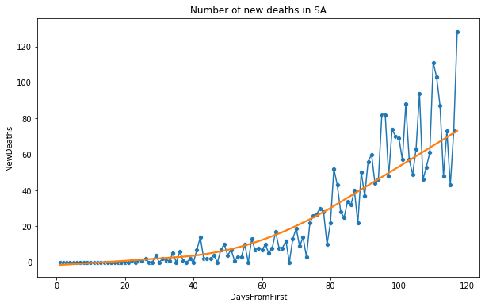

---
# COVID19 death rates South Africa
---

#### Get data from:

COVID-19 Data Repository by the Center for Systems Science and Engineering (CSSE) at Johns Hopkins University

https://github.com/CSSEGISandData/COVID-19.git

    On branch master
    Your branch is up to date with 'origin/master'.
    
    nothing to commit, working tree clean
    Already up to date.
    On branch master
    Your branch is up to date with 'origin/master'.
    
    nothing to commit, working tree clean

#### Date and time

    It is now Sun Jun 28 10:14:31 2020 GMT+2

---

### Confirmed cases and deaths

---

#### Table of last 5 rows

<table border="1" class="dataframe">
  <thead>
    <tr style="text-align: right;">
      <th></th>
      <th>Date</th>
      <th>Confirmed</th>
      <th>Deaths</th>
      <th>DaysFromFirst</th>
    </tr>
  </thead>
  <tbody>
    <tr>
      <td>153</td>
      <td>2020-06-23</td>
      <td>106108</td>
      <td>2102</td>
      <td>110</td>
    </tr>
    <tr>
      <td>154</td>
      <td>2020-06-24</td>
      <td>111796</td>
      <td>2205</td>
      <td>111</td>
    </tr>
    <tr>
      <td>155</td>
      <td>2020-06-25</td>
      <td>118375</td>
      <td>2292</td>
      <td>112</td>
    </tr>
    <tr>
      <td>156</td>
      <td>2020-06-26</td>
      <td>124590</td>
      <td>2340</td>
      <td>113</td>
    </tr>
    <tr>
      <td>157</td>
      <td>2020-06-27</td>
      <td>131800</td>
      <td>2413</td>
      <td>114</td>
    </tr>
  </tbody>
</table>

---

### Death Rates

---

---
### Model 1
#### Most naive

**The simplest** is to plot deaths against confirmed SARS-COV2 positive people and use the slope to estimate this death rate.

* No account for asymptomatic people
* No adjustment from onset of symptoms to death
* No account for delays in reporting deaths or confirmed cases

<table class="simpletable">
<caption>OLS Regression Results</caption>
<tr>
  <th>Dep. Variable:</th>         <td>Deaths</td>      <th>  R-squared (uncentered):</th>      <td>   0.997</td> 
</tr>
<tr>
  <th>Model:</th>                   <td>OLS</td>       <th>  Adj. R-squared (uncentered):</th> <td>   0.997</td> 
</tr>
<tr>
  <th>Method:</th>             <td>Least Squares</td>  <th>  F-statistic:       </th>          <td>3.796e+04</td>
</tr>
<tr>
  <th>Date:</th>             <td>Sun, 28 Jun 2020</td> <th>  Prob (F-statistic):</th>          <td>1.04e-145</td>
</tr>
<tr>
  <th>Time:</th>                 <td>10:14:33</td>     <th>  Log-Likelihood:    </th>          <td> -596.65</td> 
</tr>
<tr>
  <th>No. Observations:</th>      <td>   115</td>      <th>  AIC:               </th>          <td>   1195.</td> 
</tr>
<tr>
  <th>Df Residuals:</th>          <td>   114</td>      <th>  BIC:               </th>          <td>   1198.</td> 
</tr>
<tr>
  <th>Df Model:</th>              <td>     1</td>      <th>                     </th>              <td> </td>    
</tr>
<tr>
  <th>Covariance Type:</th>      <td>nonrobust</td>    <th>                     </th>              <td> </td>    
</tr>
</table>
<table class="simpletable">
<tr>
      <td></td>         <th>coef</th>     <th>std err</th>      <th>t</th>      <th>P>|t|</th>  <th>[0.025</th>    <th>0.975]</th>  
</tr>
<tr>
  <th>Confirmed</th> <td>    0.0201</td> <td>    0.000</td> <td>  194.843</td> <td> 0.000</td> <td>    0.020</td> <td>    0.020</td>
</tr>
</table>
<table class="simpletable">
<tr>
  <th>Omnibus:</th>       <td>42.432</td> <th>  Durbin-Watson:     </th> <td>   0.132</td>
</tr>
<tr>
  <th>Prob(Omnibus):</th> <td> 0.000</td> <th>  Jarque-Bera (JB):  </th> <td> 330.275</td>
</tr>
<tr>
  <th>Skew:</th>          <td>-0.912</td> <th>  Prob(JB):          </th> <td>1.91e-72</td>
</tr>
<tr>
  <th>Kurtosis:</th>      <td>11.099</td> <th>  Cond. No.          </th> <td>    1.00</td>
</tr>
</table>  Warnings: [1] Standard Errors assume that the covariance matrix of the errors is correctly specified.

    Using this very simple method we see a death rate of 2.01%

---
### Model 2
#### Second most naive

* No account for asymptomatic people
* No account for delays in reporting deaths or confirmed cases

One of the difficulties in calculating the COVID-19 death rate is that it is hard to know what is the time between a positive test and death.  The test could have been done pre- or post-symptomatic

From: https://www.thelancet.com/journals/laninf/article/PIIS1473-3099(20)30243-7/fulltext

#### Findings

Using data on 24 deaths that occurred in mainland China and 165 recoveries outside of China, we estimated the mean duration from onset of symptoms to death to be 17·8 days (95% credible interval [CrI] 16·9–19·2) and to hospital discharge to be 24·7 days (22·9–28·1). In all laboratory confirmed and clinically diagnosed cases from mainland China (n=70 117), we estimated a crude case fatality ratio (adjusted for censoring) of 3·67% (95% CrI 3·56–3·80). However, after further adjusting for demography and under-ascertainment, we obtained a best estimate of the case fatality ratio in China of 1·38% (1·23–1·53), with substantially higher ratios in older age groups (0·32% [0·27–0·38] in those aged <60 years vs 6·4% [5·7–7·2] in those aged ≥60 years), up to 13·4% (11·2–15·9) in those aged 80 years or older. Estimates of case fatality ratio from international cases stratified by age were consistent with those from China (parametric estimate 1·4% [0·4–3·5] in those aged <60 years [n=360] and 4·5% [1·8–11·1] in those aged ≥60 years [n=151]). Our estimated overall infection fatality ratio for China was 0·66% (0·39–1·33), with an increasing profile with age. Similarly, estimates of the proportion of infected individuals likely to be hospitalised increased with age up to a maximum of 18·4% (11·0–37·6) in those aged 80 years or older.

    Using 18 days in the time adjustment

<table class="simpletable">
<caption>OLS Regression Results</caption>
<tr>
  <th>Dep. Variable:</th>         <td>Deaths</td>      <th>  R-squared (uncentered):</th>      <td>   0.993</td> 
</tr>
<tr>
  <th>Model:</th>                   <td>OLS</td>       <th>  Adj. R-squared (uncentered):</th> <td>   0.993</td> 
</tr>
<tr>
  <th>Method:</th>             <td>Least Squares</td>  <th>  F-statistic:       </th>          <td>1.371e+04</td>
</tr>
<tr>
  <th>Date:</th>             <td>Sun, 28 Jun 2020</td> <th>  Prob (F-statistic):</th>          <td>2.16e-105</td>
</tr>
<tr>
  <th>Time:</th>                 <td>10:14:33</td>     <th>  Log-Likelihood:    </th>          <td> -552.38</td> 
</tr>
<tr>
  <th>No. Observations:</th>      <td>    97</td>      <th>  AIC:               </th>          <td>   1107.</td> 
</tr>
<tr>
  <th>Df Residuals:</th>          <td>    96</td>      <th>  BIC:               </th>          <td>   1109.</td> 
</tr>
<tr>
  <th>Df Model:</th>              <td>     1</td>      <th>                     </th>              <td> </td>    
</tr>
<tr>
  <th>Covariance Type:</th>      <td>nonrobust</td>    <th>                     </th>              <td> </td>    
</tr>
</table>
<table class="simpletable">
<tr>
      <td></td>         <th>coef</th>     <th>std err</th>      <th>t</th>      <th>P>|t|</th>  <th>[0.025</th>    <th>0.975]</th>  
</tr>
<tr>
  <th>Confirmed</th> <td>    0.0511</td> <td>    0.000</td> <td>  117.099</td> <td> 0.000</td> <td>    0.050</td> <td>    0.052</td>
</tr>
</table>
<table class="simpletable">
<tr>
  <th>Omnibus:</th>       <td>37.114</td> <th>  Durbin-Watson:     </th> <td>   0.071</td>
</tr>
<tr>
  <th>Prob(Omnibus):</th> <td> 0.000</td> <th>  Jarque-Bera (JB):  </th> <td> 135.192</td>
</tr>
<tr>
  <th>Skew:</th>          <td>-1.193</td> <th>  Prob(JB):          </th> <td>4.40e-30</td>
</tr>
<tr>
  <th>Kurtosis:</th>      <td> 8.269</td> <th>  Cond. No.          </th> <td>    1.00</td>
</tr>
</table>  Warnings: [1] Standard Errors assume that the covariance matrix of the errors is correctly specified.

    Adjusting for time we find a death rate of 5.11%

---

### Model 3
#### Third most naive

* No account for delays in reporting deaths or confirmed cases
* Couch epidemiology

Use the time adjusted dataframe and adjust for asymptomatic

    Use an asymptomatic rate of 40.0%

Adjusting for asymptomatic infected people is another difficulty.  

<table border="1" class="dataframe">
  <thead>
    <tr style="text-align: right;">
      <th></th>
      <th>testDate</th>
      <th>Confirmed</th>
      <th>deathDate</th>
      <th>Deaths</th>
      <th>Asymptomatic</th>
      <th>EstTotalInfected</th>
    </tr>
  </thead>
  <tbody>
    <tr>
      <td>92</td>
      <td>2020-06-05</td>
      <td>43434</td>
      <td>2020-06-23</td>
      <td>2102</td>
      <td>28956.0</td>
      <td>72390.0</td>
    </tr>
    <tr>
      <td>93</td>
      <td>2020-06-06</td>
      <td>45973</td>
      <td>2020-06-24</td>
      <td>2205</td>
      <td>30648.0</td>
      <td>76621.0</td>
    </tr>
    <tr>
      <td>94</td>
      <td>2020-06-07</td>
      <td>48285</td>
      <td>2020-06-25</td>
      <td>2292</td>
      <td>32190.0</td>
      <td>80475.0</td>
    </tr>
    <tr>
      <td>95</td>
      <td>2020-06-08</td>
      <td>50879</td>
      <td>2020-06-26</td>
      <td>2340</td>
      <td>33919.0</td>
      <td>84798.0</td>
    </tr>
    <tr>
      <td>96</td>
      <td>2020-06-09</td>
      <td>52991</td>
      <td>2020-06-27</td>
      <td>2413</td>
      <td>35327.0</td>
      <td>88318.0</td>
    </tr>
  </tbody>
</table>

<table class="simpletable">
<caption>OLS Regression Results</caption>
<tr>
  <th>Dep. Variable:</th>         <td>Deaths</td>      <th>  R-squared (uncentered):</th>      <td>   0.993</td> 
</tr>
<tr>
  <th>Model:</th>                   <td>OLS</td>       <th>  Adj. R-squared (uncentered):</th> <td>   0.993</td> 
</tr>
<tr>
  <th>Method:</th>             <td>Least Squares</td>  <th>  F-statistic:       </th>          <td>1.371e+04</td>
</tr>
<tr>
  <th>Date:</th>             <td>Sun, 28 Jun 2020</td> <th>  Prob (F-statistic):</th>          <td>2.16e-105</td>
</tr>
<tr>
  <th>Time:</th>                 <td>10:14:33</td>     <th>  Log-Likelihood:    </th>          <td> -552.38</td> 
</tr>
<tr>
  <th>No. Observations:</th>      <td>    97</td>      <th>  AIC:               </th>          <td>   1107.</td> 
</tr>
<tr>
  <th>Df Residuals:</th>          <td>    96</td>      <th>  BIC:               </th>          <td>   1109.</td> 
</tr>
<tr>
  <th>Df Model:</th>              <td>     1</td>      <th>                     </th>              <td> </td>    
</tr>
<tr>
  <th>Covariance Type:</th>      <td>nonrobust</td>    <th>                     </th>              <td> </td>    
</tr>
</table>
<table class="simpletable">
<tr>
          <td></td>            <th>coef</th>     <th>std err</th>      <th>t</th>      <th>P>|t|</th>  <th>[0.025</th>    <th>0.975]</th>  
</tr>
<tr>
  <th>EstTotalInfected</th> <td>    0.0307</td> <td>    0.000</td> <td>  117.095</td> <td> 0.000</td> <td>    0.030</td> <td>    0.031</td>
</tr>
</table>
<table class="simpletable">
<tr>
  <th>Omnibus:</th>       <td>37.126</td> <th>  Durbin-Watson:     </th> <td>   0.071</td>
</tr>
<tr>
  <th>Prob(Omnibus):</th> <td> 0.000</td> <th>  Jarque-Bera (JB):  </th> <td> 135.252</td>
</tr>
<tr>
  <th>Skew:</th>          <td>-1.193</td> <th>  Prob(JB):          </th> <td>4.27e-30</td>
</tr>
<tr>
  <th>Kurtosis:</th>      <td> 8.270</td> <th>  Cond. No.          </th> <td>    1.00</td>
</tr>
</table>  Warnings: [1] Standard Errors assume that the covariance matrix of the errors is correctly specified.

    The death rate adjusting for time and asymtomatic cases is 3.07%

---
Many things not considered

### Daily new

---

---
